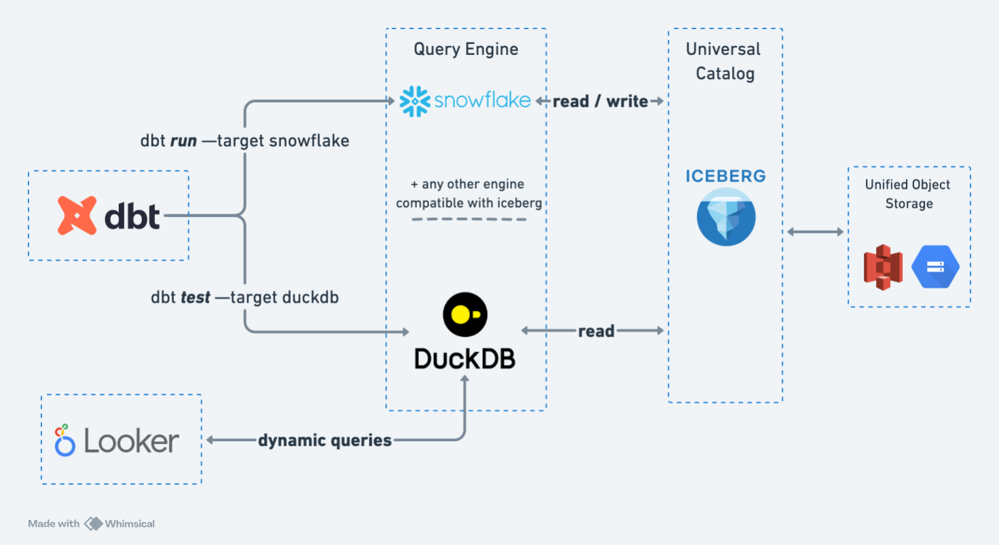

# Multistack dbt and iceberg



This is a  proof of concept on how to use dbt with iceberg to run a multi-stack environment.

### running the models with snowflake creating iceberg tables

### running the tests with duckdb against the tables in iceberg

This example uses Snowflake as the main engine to create iceberg tables and duckdb as a secondary engine to run tests.

For now, Snowflake only offers a catalog where only Snowflake can write, but any other engines can read. With Polaris this will change tho!.


# Extending dbt to work with Iceberg
 - Modify the create table adaptor for snowflake to write in Iceberg format
    - dbt will dynamically compile the path where snowflake will write the data based on the name of the model. So for example `stg_customers` will end up being written in the storage lager like `s3://mybucket/iceberg/stg_customers`.
 - duckdb right now only accepts reading iceberg directly from folders, without any write operations. To enable this we also extended the ref macro from dbt to modify the compiled ref to use the read_iceberg() of the actual folder snowflake wrote to through iceberg. So at compilation time in dbt we can change the reference to `read_iceberg('s3://mybucket/iceberg/stg_customers')`. 
    - Because Snowflake writes the version-hint.txt, we are safe with duckdb to always read the latest version of the data, and we can bypass the need of a catalog.
    - This is obviously not ideal, but for now is the only acailable option duckdb provides.


Now, depending on the target, we will be able to access exactly the same data, but through different engines:
 - With snowflake we can run CREATE + SELECT operations
 - With duckdb we can run SELECT operations


This is just a proof of concept that it's possible to have dbt working as a multi-stack transformation layer. A lot of decisions/code could have been done in a different way.

# How to get it running:

* Create a bucket you can use externally (GCS, S3...)
* [Configure an external volumen in Snowflake](https://docs.snowflake.com/en/user-guide/tables-iceberg-configure-external-volume-s3). This will use the previous bucket to store the data
    * Update the following vars in dbt_project.yml
    ```yml
        vars:
            catalog_iceberg: 'SNOWFLAKE' # Keep as snowflake if you want to use the snowflake catalog
            external_volume_iceberg: 'my-external-volume-in-snowflake' # volume name you just created in snowflake
            storage_base_url_iceberg: 's3://my-bucket/iceberg' # storage url used as base for accessing through duckdb directly as for now we can't have access to a catalog. This property could probably be dynamic based on models and not global.
    ```
* Configure your dbt profiles.yml by adding the credentials to connect to snowflake and duckdb, there's an example in this project.
* Profit

# Run dbt

You just have to decide the --target. Remember that duck doesn't allow writing, so only tests can be run with that engine

* `dbt run --target snowflake`
* `dbt test --target duckdb` 